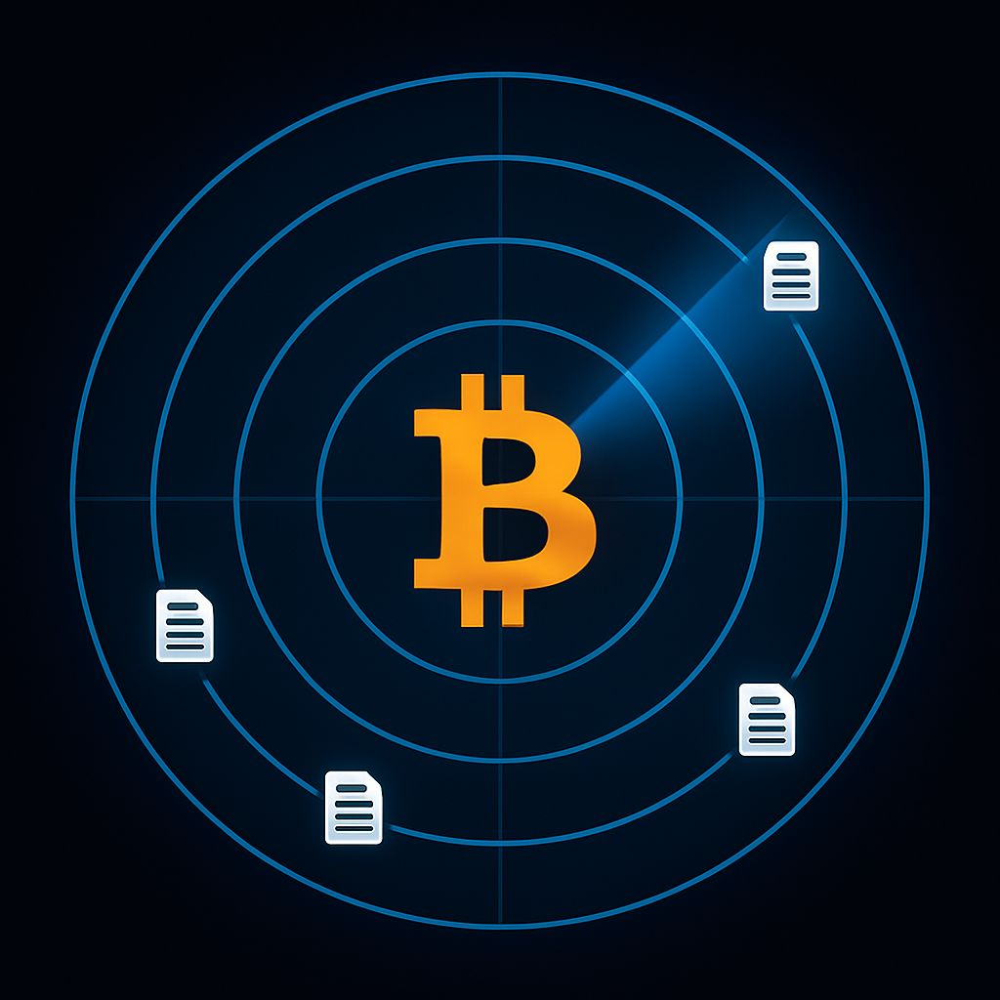

# Bitcoin News Scanner



**Project for Bitcoin 2025 Hackathon: https://b.tc/conference/2025/hackathon**

**IMPORTANT DISCLAIMER: This tool is for educational and research purposes only. It does not provide financial advice and should not be used as a basis for investment decisions. Always conduct your own research before making any Bitcoin-related decisions.**

## Key Features Highlights

- **AI-Powered News Analysis**: Advanced AI algorithms detect potentially significant Bitcoin developments that might be overlooked by standard news aggregators
- **Multi-Source Integration**: Aggregates and analyzes news from 8+ distinct Bitcoin information sources including news sites, social media, and specialized platforms
- **Smart Content Classification**: Identifies "under the radar" content through sophisticated text analysis and ranking algorithms
- **Market Sentiment Correlation**: Correlates news findings with TradingView technical indicators to identify potential sentiment-reality divergences
- **Interactive Web Dashboard**: User-friendly interface for monitoring Bitcoin information (currently under development)

## Project Overview

Bitcoin News Scanner helps researchers and Bitcoin enthusiasts stay informed by monitoring multiple information sources and using AI to identify potentially noteworthy Bitcoin developments that may not be receiving mainstream attention yet.

## Detailed Features

- **Comprehensive News Monitoring**: Automatically scans popular Bitcoin news sources for new articles and information.
- **Advanced AI Analysis**: Employs natural language processing to identify significant Bitcoin developments and classify their potential importance.
- **Sentiment Correlation**: Checks TradingView's technical indicators to compare market sentiment with emerging news.
- **Real-time Notifications**: Sends desktop alerts when potentially significant information is detected.
- **Email Digests**: Configurable email notifications with options for instant alerts or daily/hourly summaries.
- **Content Tracking**: Maintains a database of previously processed content to eliminate duplicates.
- **Scheduled Scanning**: Automatically scans for new information every 30 minutes.
- **Web Interface**: Browser-based UI to view detected information (in active development, some features may be limited).

## How Information Analysis Works

The Bitcoin News Scanner uses two complementary methods to analyze Bitcoin-related information:

### AI Analysis (Default)
By default, the scanner uses sophisticated AI analysis:
- The AI evaluates content for potentially overlooked but significant information ("under the radar")
- It assesses whether the information contains meaningful developments relevant to Bitcoin
- The system applies multiple criteria to rank content importance
- Detailed AI reasoning is available in the log output for transparency

### Keyword Analysis (Optional)
The scanner can also use traditional keyword-based analysis:
- Analyzes content for specific technical, regulatory, and adoption-related keywords
- Content with a high significance score (>0.6) receives higher attention
- This method is disabled by default but can be enabled in config.py for complementary analysis

### Configuration Options
You can customize the analysis system in config.py:
- `USE_AI_ANALYSIS = True/False` - Enable/disable AI-based analysis
- `USE_TRADITIONAL_ANALYSIS = True/False` - Enable/disable keyword-based analysis
- `DEBUG_AI = True/False` - Show detailed AI evaluation process in console output

## News Sources

The Bitcoin News Scanner collects articles from these sources:

1. **Bitcoinist** - Popular Bitcoin news site
2. **Cointelegraph** - Major cryptocurrency news source 
3. **CryptoPanic** - News aggregator with real-time updates (requires API key)
4. **Reddit Bitcoin** - Posts from the r/Bitcoin subreddit with smart filtering
   - Scans multiple sort types: hot, rising, and new posts
   - Uses VIP keyword detection to ensure important posts from key figures (like Jack Dorsey) are never filtered out
   - Intelligently extracts comments for posts with minimal content
5. **Google Search** - Fresh Bitcoin news from Google search results
6. **Bitcoin Magazine** - News from the longest-running Bitcoin publication
7. **Bitcoin News RSS** - Comprehensive RSS feed aggregator combining news from:
   - Bitcoin.com News
   - Bitcoin Magazine
   - Cointelegraph Bitcoin feed
   - CoinDesk
8. **TradingView Key Facts** - High-value insights from TradingView's "Key facts today" section
   - Extracts comments from industry leaders (like BlackRock's CEO)
   - Captures institutional perspectives on Bitcoin
   - Identifies under-the-radar insights that may impact Bitcoin price
   - Also includes curated Bitcoin news from TradingView's dedicated BTC/USD news page
9. **TradingView BTC/USD News** - Curated news feed from TradingView's BTC/USD page

More sources are being added regularly.

> **TradingView Integration**: The scanner also monitors TradingView's technical indicators for Bitcoin to identify market sentiment, but doesn't collect news articles from TradingView.

### Adding the CryptoPanic API Key

To use the CryptoPanic source, you need to:

1. Register for an account at [cryptopanic.com](https://cryptopanic.com/)
2. Get your API key from [cryptopanic.com/developers/api/](https://cryptopanic.com/developers/api/)
3. Add it to your `.env` file:
   ```
   CRYPTOPANIC_API_KEY=your_api_key_here
   ```

### Setting Up Email Notifications

The Bitcoin News Scanner can send you email notifications when it finds investment opportunities. To set up email notifications:

1. Configure your email settings in your `.env` file:
   ```
   # Enable email notifications
   EMAIL_ENABLED=true
   
   # Your email address
   EMAIL_SENDER=your.email@gmail.com
   
   # App password for your email account
   # For Gmail, create an app password at: https://myaccount.google.com/apppasswords
   EMAIL_PASSWORD=your-app-password
   
   # Recipients (comma-separated list)
   EMAIL_RECIPIENTS=recipient1@example.com,recipient2@example.com
   
   # Notification frequency: "instant", "hourly", or "daily"
   EMAIL_FREQUENCY=instant
   ```

2. For Gmail users:
   - First, you must enable 2-Step Verification for your Google account:
     1. Go to your [Google Account Security settings](https://myaccount.google.com/security)
     2. Select "2-Step Verification" and follow the steps to turn it on
   - Once 2-Step Verification is enabled, you can create an App Password:
     1. Go back to [Security settings](https://myaccount.google.com/security)
     2. Scroll down to "App passwords" (it only appears after 2-Step Verification is enabled)
     3. Select "App passwords" and follow the prompts
     4. Choose "Other" as the app name and type "Bitcoin News Scanner"
     5. Google will generate a 16-character password - use this in your `.env` file
   - Alternatively, you can use an email service like SendGrid that doesn't require 2-Step Verification

3. Email notification frequencies:
   - `instant`: Sends an email immediately when an opportunity is detected
   - `hourly`: Collects opportunities and sends a digest email once per hour
   - `daily`: Collects opportunities and sends a digest email once per day

## Installation

1. Clone this repository:
```bash
git clone https://github.com/username/bitcoin-news-scanner.git
cd bitcoin-news-scanner
```

2. Set up a virtual environment and activate it:
```bash
# Create the virtual environment
python3 -m venv venv

# Activate the virtual environment
source venv/bin/activate
```

3. Install dependencies:
```bash
pip3 install -r requirements.txt
```

4. Download the required NLTK data:
```bash
python3 -c "import nltk; nltk.download('punkt'); nltk.download('stopwords')"
```

## Usage

### Basic Usage

Activate the virtual environment:

```bash
source venv/bin/activate
```

Run the scanner:

```bash
python main.py
```

### Command Line Options

- `--once`: Run a single scan and exit (don't start the scheduler)
- `--force-rescan`: Force rescan of articles that have already been seen
- `--show-recent`: Show opportunities detected in the last 24 hours

Examples:

```bash
# Run once and exit
python main.py --once

# Force rescan of already seen articles
python main.py --force-rescan

# Show recently detected opportunities
python main.py --show-recent

# Run once with force rescan
python main.py --once --force-rescan

# View recent opportunities then start scanning
python main.py --show-recent
```

### Testing a Single URL

You can test whether a specific article would be considered an "under the radar" investment opportunity using the test_url.py script:

```bash
# Test any URL to see if it would be flagged as an opportunity
python test_url.py https://example.com/some-bitcoin-article
```

For easier testing with proper environment setup, use the provided shell script:

```bash
# Test a single URL (handles virtual environment activation)
./test_single_url.sh https://example.com/some-bitcoin-article
```

The script will:
- Fetch and analyze the article content
- Use your configured GPT model (from .env)
- Show detailed analysis results including:
  - Whether it's considered "under the radar"
  - If it represents a "buy signal"
  - The significance score and AI reasoning
  - Whether it would be flagged as an investment opportunity

This is useful for:
- Debugging why certain articles are/aren't being flagged
- Testing different GPT models on the same content
- Manually evaluating suspicious or interesting articles

### Web User Interface

The Bitcoin News Scanner includes a web-based user interface that displays investment opportunities in your browser:
```bash
# Start the web interface
python web_ui.py
```

The web UI provides these features:
- View all investment opportunities in a clean, modern interface
- Click on any opportunity to open the original article in your browser
- Real-time updates with auto-refresh every 30 seconds
- Control the scanner directly from the web interface
- See AI analysis for each opportunity
- "Force Rescan" button to reprocess all articles
- Visual status indicators during operations

The web interface runs on port 7777 by default and will automatically open in your default browser. If the browser doesn't open automatically, visit:
```
http://127.0.0.1:7777
```

If the default port is in use, you can specify a different port:
```bash
python web_ui.py --port 9090
```

#### Stopping the Web UI

To stop all instances of the web UI that might be running in the background:

```bash
# Quick way (macOS/Linux)
./stop_web_ui.sh

# Or manually kill the process
pkill -f "python web_ui.py"
```

The web interface requires Flask, which should be installed with the other dependencies. If it's not installed:

```bash
pip install flask
```

### Helper Scripts

The Bitcoin News Scanner comes with several helper scripts to make it easier to run and manage:

#### 1. run_scanner.sh

Run the scanner in the foreground with all output visible in the terminal:

```bash
# Run the scanner with live terminal output
./run_scanner.sh

# You can also pass command-line arguments
./run_scanner.sh --once
./run_scanner.sh --show-recent
```

Use this script when you want to see real-time output from the scanner. Press Ctrl+C to stop it.

#### 2. start_scanner.sh

Start the scanner as a background process that continues running even if you close the terminal:

```bash
# Start the scanner in the background
./start_scanner.sh

# Start with web UI
./start_scanner.sh --web-ui

# Start with other options
./start_scanner.sh --show-recent --force-rescan
```

#### 3. run_single_source.sh

Run a specific news source for testing and debugging:

```bash
# Test just one news source (e.g., Reddit Bitcoin)
./run_single_source.sh "Reddit Bitcoin"

# Available sources:
./run_single_source.sh "Bitcoinist"
./run_single_source.sh "Cointelegraph"
./run_single_source.sh "CryptoPanic"
./run_single_source.sh "Google Search"
./run_single_source.sh "Bitcoin Magazine"
./run_single_source.sh "Bitcoin News RSS"
./run_single_source.sh "TradingView"
```

This is useful for debugging specific sources without running the entire scanner, especially when testing enhancements like the VIP keyword detection for Reddit posts.

This script:
- Creates log files in the logs/ directory
- Keeps the scanner running in the background
- Optionally starts the web UI
- Records process IDs for clean shutdown

#### 3. stop_scanner.sh

Stop the scanner and web UI processes started by start_scanner.sh:

```bash
# Stop all running scanner processes
./stop_scanner.sh
```

### What to Expect

When running in continuous mode:
1. You'll see a real-time countdown to the next scan
2. The app will scan automatically every 5 minutes
3. To stop the scanner, press `Ctrl+C` in the terminal

When the scanner detects a significant article during a negative market sentiment, it will:
1. Show a desktop notification with the article title
2. Print details to the console
3. Automatically open the article in your default web browser

The scanner will automatically maintain a database of seen articles to avoid duplicates.

## AI Analysis Integration

The Bitcoin News Scanner includes an AI analysis feature to detect under-the-radar opportunities that might not be obvious through keyword or sentiment analysis alone. There are two modes of operation:

### 1. Mock AI Analysis (Default)

By default, the scanner uses a mock AI implementation that simulates AI analysis using predefined rules and patterns. This mode doesn't require any API keys and works offline.

### 2. OpenAI GPT Integration

For more sophisticated analysis, you can integrate with OpenAI's GPT models:

1. Install the required packages:
   ```
   pip install -r requirements.txt
   ```

2. Create a `.env` file from the template:
   ```bash
   cp .env.template .env
   ```

3. Edit the `.env` file to add your OpenAI API key:
   ```
   OPENAI_API_KEY=your_api_key_here
   USE_REAL_AI=true
   GPT_MODEL=gpt-4o  # Optional: Select which GPT model to use
   ```

4. Run the scanner as usual:
   ```bash
   python main.py
   ```

The system will automatically detect your API key and use the OpenAI API for analysis. If there's any error connecting to the API, it will fall back to the mock implementation.

> **Security Note**: The `.env` file is excluded from git via `.gitignore` to prevent accidentally committing your API key to version control. Never add your actual API keys to files that will be committed to a repository.

### GPT Model Selection

You can specify which OpenAI GPT model to use via the `GPT_MODEL` environment variable. Each model offers different capabilities:

| Model | Description | Best For |
|-------|-------------|----------|
| **gpt-3.5-turbo** | Fast and economical, adequate for basic analysis | Testing, development, or budget constraints |
| **gpt-4** | More capable reasoning and analytical abilities | Production use with good balance of cost and performance |
| **gpt-4-turbo** | Enhanced capabilities with optimization for speed | Performance-critical applications |
| **gpt-4o** | OpenAI's most advanced model with superior analysis | Highest quality investment opportunity detection |

For Bitcoin news analysis, more advanced models like GPT-4o provide:
- Better detection of subtle market signals
- More accurate opportunity scoring
- Reduced false positives
- More in-depth analysis of market implications
- Superior ability to identify "under the radar" information

#### GPT Model Cost Comparison

The cost difference between models is significant:

- **gpt-3.5-turbo**: Lowest cost (approximately 1/10th the cost of GPT-4)
- **gpt-4**: Much more expensive than 3.5, but more capable
- **gpt-4-turbo**: Slightly less expensive than standard GPT-4
- **gpt-4o**: Comparable pricing to GPT-4, but with improved capabilities

By default, the Bitcoin News Scanner uses gpt-3.5-turbo as the most economical option. For budget-conscious users, this provides a good balance of functionality and cost. The scanner will still identify obvious opportunities with this model, though it may miss more subtle signals that the more advanced models would catch.

If API costs are a concern but you want improved analysis, consider running the scanner less frequently with a better model rather than more frequently with gpt-3.5-turbo.

#### Model Filtering Behavior Differences

In testing, we've observed significant differences in how the models filter opportunities:

- **GPT-3.5-turbo** tends to be more inclusive, flagging more articles as potential opportunities. It may generate 2-3x more results than GPT-4o. This includes more sensationalist headlines and speculative content.

- **GPT-4o** is considerably more selective and discerning. It typically flags fewer articles but focuses on higher-quality opportunities from established sources. It's better at filtering out hype and focusing on substantial developments.

If you're frequently overwhelmed by too many notifications or find yourself manually filtering out many false positives, upgrading to GPT-4o might actually save you time despite the higher cost. Conversely, if you prefer to see more potential opportunities and do your own filtering, GPT-3.5-turbo might be preferable.

The models are priced differently, with more capable models costing more tokens. For investment opportunity detection, the additional cost of an advanced model may be justified by identifying valuable opportunities that simpler models miss.

## Configuration

The application can be configured using environment variables in a `.env` file:

- `OPENAI_API_KEY`: Your OpenAI API key (required for AI analysis)
- `USE_REAL_AI`: Use the real OpenAI API instead of mock responses (default: true)
- `GPT_MODEL`: Select which OpenAI model to use (options: gpt-3.5-turbo, gpt-4, gpt-4-turbo, gpt-4o) (default: gpt-3.5-turbo)
- `FETCH_LIMIT`: Maximum number of articles to fetch from each source (default: 10)
- `SENTIMENT_CHECK_INTERVAL`: How often to check TradingView sentiment in minutes (default: 60)
- `SCAN_INTERVAL`: How often to scan for news in minutes (default: 5)
- `SIGNIFICANCE_THRESHOLD`: Threshold for considering an article significant (default: 0.3)
- `DEBUG_ENABLED`: Enable debug output for API calls (default: false)
- `USE_AI_ANALYSIS`: Use AI analysis for opportunity detection (default: true)
- `USE_TRADITIONAL_ANALYSIS`: Use traditional keyword analysis for opportunity detection (default: false)
- `SIMPLIFIED_OUTPUT`: Use simplified logging output that's easier to read (default: false)
- `WEB_PORT`: Port to use for the web interface (default: 7777)

For more detailed configuration, see the `.env.template` file and `config.py`.

### Database Information

The Bitcoin News Scanner stores its data in a JSON file located in the project root directory:

- **Database File**: `article_database.json` (defined in config.py as `DB_FILE`)
- **Contents**: Stores previously seen articles and recorded investment opportunities
- **Reset Process**: If you need to reset the scanner (e.g., for testing purposes), you can simply delete this file:
  ```bash
  rm article_database.json
  ```
  The scanner will create a new database file on the next run.

## Output Modes

The application supports two output modes:

### Detailed Output (default)
Shows comprehensive information about each article and opportunity, including:
- Full article title
- Source name
- URL
- AI analysis
- Significance factors

### Simplified Output
A cleaner output format that only shows essential information:
- Source being scanned
- Number of articles found in each source
- Just the URLs of opportunities detected
- Summary of total opportunities found

To enable simplified output, set the `SIMPLIFIED_OUTPUT` environment variable to `true`.

## Adding New Sources

The system is designed to be easily extensible. To add a new source:

1. Create a new source class in the `sources/` directory that inherits from `NewsSource`
2. Register the source in `sources/source_factory.py`
3. Add the source name to `ACTIVE_SOURCES` in `config.py`

## Troubleshooting

- **Python command not found**: Use `python3` instead of `python`
- **No notifications appearing**: Check that your OS allows notifications from Python applications
- **Scan not running**: Make sure the virtual environment is activated
- **No new articles detected**: The scanner maintains a database of seen articles - it won't notify about the same article twice

## License and Disclaimer

This software is provided for educational and research purposes only. It is not intended to provide investment advice or recommendations. 

The creators of Bitcoin News Scanner are not financial advisors, and the tool should not be used as a basis for financial decisions. All information provided by this tool should be independently verified.

Use at your own risk.
